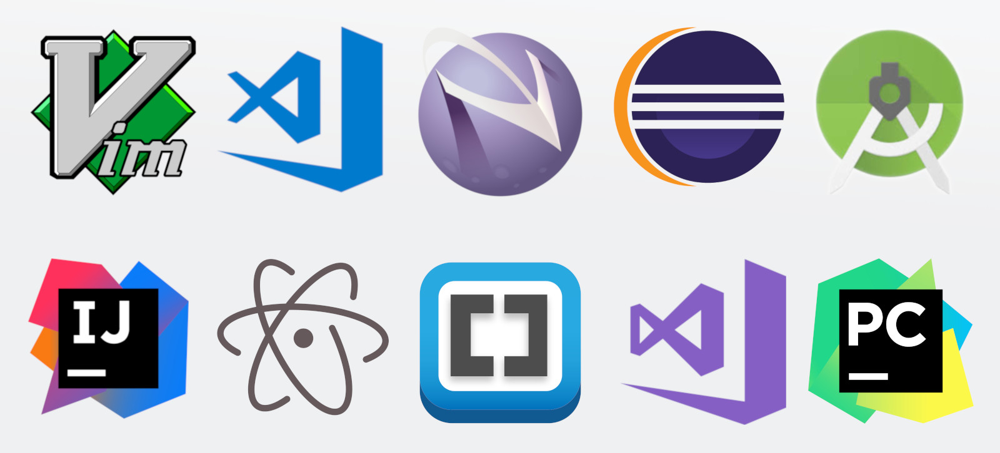

# 💎 Concept of IDE & Text Editor
> IDE and Text Editors are programs that developers use to write, edit, and manage programs and provide them with various features.
However, there are differences between the two, which we will discuss below

