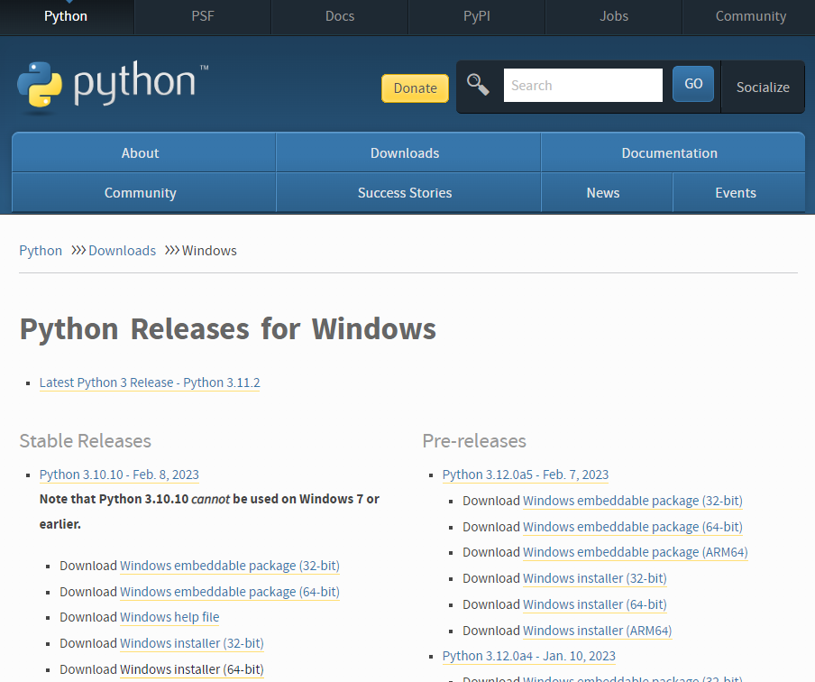
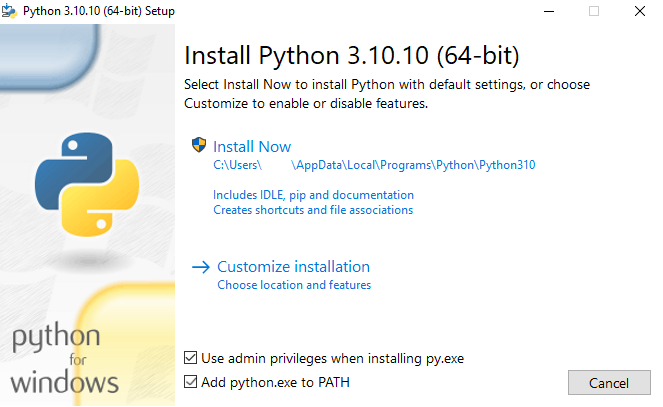
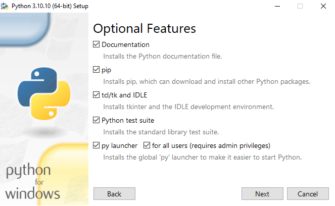
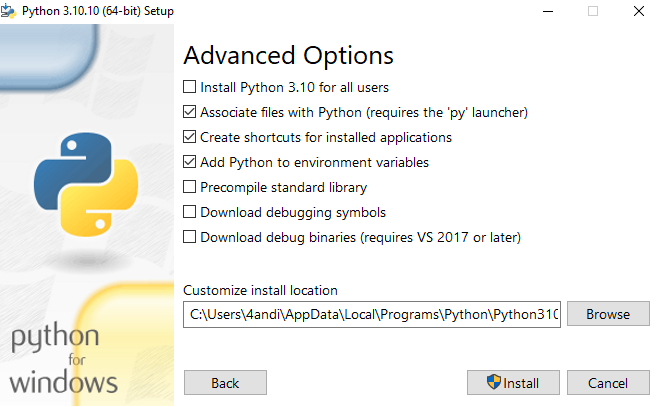
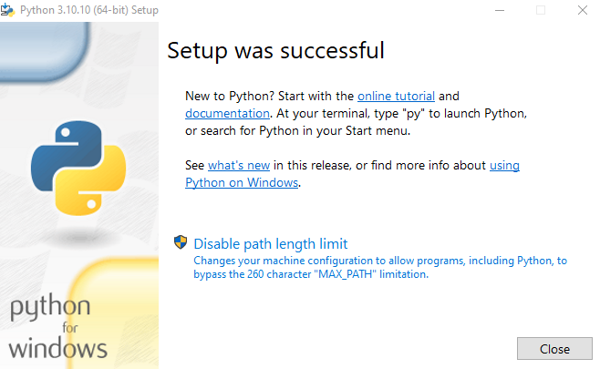

## ⭕️ موضوعاتی که در این فصل مورد بحث قرار می‌دهیم:

- [مفهوم IDE و ویرایشگر متن](#concept-of-ide--text-editor)
- [نصب زبان برنامه نویسی پایتون](#-how-to-install-python)

</br>


# 💎مفهوم IDE و ویرایشگر متن
> یک IDE و Text Editor برنامه هایی هستند که توسعه دهندگان برای نوشتن، ویرایش و مدیریت برنامه ها از آن ها استفاده می‌کنند و امکانات های مختلفی را برای آن ها فراهم می‌کنند 
اما با این حال تفاوت هایی بین این دو وجود دارد که در ادامه آن ها را برسی می‌کنیم

### **مفهوم IDE** =>
- محیط توسعه یکپارچه (IDE) یک نرم افزار کاربردی است که امکانات جامعی را برای برنامه نویسان کامپیوتر برای توسعه نرم افزار فراهم می کند. یک IDE معمولاً از یک ویرایشگر کد منبع، ابزارهای اتوماسیون ساخت و یک دیباگر تشکیل شده است. همچنین می‌تواند شامل ویژگی‌هایی مانند یکپارچه‌سازی کنترل نسخه، سازندگان رابط کاربری گرافیکی (GUI) و بسیاری از ابزارهای دیگر باشد که به ساده‌سازی و خودکارسازی فرآیند توسعه نرم‌افزار کمک می‌کنند.

### **مفهوم Text Editor** =>
- ویرایشگر متن نرم افزاری است که برای ویرایش فایل های متنی ساده استفاده می شود. برخلاف IDE، یک ویرایشگر متن هیچ ویژگی داخلی برای کامپایل یا اشکال زدایی کد ندارد. ویرایشگرهای متن عمدتاً توسط توسعه دهندگانی استفاده می شود که ابزارهای سبک وزن و قابل تنظیم را برای نوشتن کد ترجیح می دهند. برخی از ویرایشگرهای متن محبوب عبارتند از Atom، Sublime Text و Visual Studio Code.

---
##### 🔹در حالی که هر دو IDE و ویرایشگر متن را می توان برای نوشتن کد استفاده کرد، تفاوت اصلی بین آنها این است که IDE ها مجموعه جامع تری از ابزارها را ارائه می دهند که به طور خاص برای توسعه نرم افزار طراحی شده اند، در حالی که ویرایشگرهای متن رویکرد حداقلی تری را با ویژگی های داخلی کمتر ارائه می دهند. در نهایت، انتخاب بین استفاده از یک IDE یا یک ویرایشگر متن به اولویت شخصی و نیازهای خاص توسعه دهنده بستگی دارد.
---

</br>


</br>

## 💢 تفاوت بین IDE و ویرایشگر متن

1️⃣ محیط توسعه یکپارچه (IDE) یک محیط توسعه یکپارچه است که شامل ابزارهایی مانند کدنویسی، اشکال زدایی، کامپایل و آزمایش است. این ابزارها به طور خودکار با یکدیگر همگام می شوند و به برنامه نویسان کمک می کنند تا به سرعت برنامه های پیچیده بسازند.

2️⃣ ویراشگر متن برنامه ای است که برای ویرایش و نوشتن کدهای برنامه نویسی استفاده می شود. این ابزارها معمولاً فقط دارای قابلیت ویرایش متن هستند و هیچ ابزار دیگری مانند دیباگرها، کامپایلرها و تسترها ندارند.

3️⃣ محیط توسعه یکپارچه (IDE)  ها معمولا برای پروژه های پیچیده و بزرگ استفاده می شوند، در حالی که ویرایشگرهای متن برای پروژه های کوچکتر و ساده تر استفاده می شوند.

4️⃣ محیط توسعه یکپارچه (IDE) ها توانایی تشخیص خطاهای کد را دارند و به برنامه نویسان کمک می کنند تا برنامه را بهتر و سریعتر اجرا کنند، در حالی که ویرایشگرهای متن این قابلیت را ندارند.

5️⃣ محیط توسعه یکپارچه (IDE) ها معمولا برای زبان های برنامه نویسی خاص مانند جاوا، سی پلاس پلاس و پایتون طراحی می شوند، در حالی که ویرایشگرهای متن را می توان برای همه زبان های برنامه نویسی استفاده کرد..

***

</br>

# 🐍 نحوه نصب پایتون
> در این مقاله نحوه نصب پایتون در ویندوز را به شما آموزش می دهیم. زبان برنامه نویسی پایتون بر خلاف سایر سیستم عامل ها مانند سیستم عامل مک و لینوکس به طور پیش فرض روی سیستم عامل ویندوز نصب نمی شود. با این حال، این بدان معنا نیست که این زبان برنامه نویسی برای کاربران ویندوز مفید نخواهد بود یا کاربران ویندوز نمی توانند برنامه های کاربردی خود را با استفاده از این زبان برنامه ریزی کنند.

## مرحله 1 - دانلود نصب کننده پایتون
1️⃣ به صفحه رسمی دانلود پایتون برای ویندوز بروید.

2️⃣ نسخه پایدار پایتون 3 را پیدا کنید. این آموزش با نسخه 3.10.10 پایتون تست شده است.

3️⃣ برای دانلود فایل اجرایی روی لینک مناسب برای سیستم خود کلیک کنید: Windows installer (64 بیتی) یا Windows installer (32 بیت).



## مرحله 2 - اجرای نصب کننده اجرایی
1️⃣ پس از دانلود نصب کننده، روی فایل .exe، به عنوان مثال python-3.10.10-amd64.exe، دوبار کلیک کنید تا نصب کننده پایتون اجرا شود.

2️⃣ چک باکس Install launcher for all users را انتخاب کنید، که همه کاربران رایانه را قادر می سازد به برنامه راه اندازی پایتون دسترسی داشته باشند.

3️⃣ چک باکس Add python.exe to PATH را انتخاب کنید که به کاربران امکان می دهد پایتون را از خط فرمان راه اندازی کنند.



4️⃣ اگر به تازگی با پایتون شروع کرده اید و می خواهید آن را با ویژگی های پیش فرض همانطور که در گفتگو توضیح داده شده است نصب کنید، روی Install Now کلیک کنید و به مرحله 4 بروید - تأیید نصب پایتون. برای نصب سایر ویژگی های اختیاری و پیشرفته، روی Customize install کلیک کرده و ادامه دهید.

5️⃣ویژگی های اختیاری شامل ابزارها و منابع رایج برای پایتون است و می توانید همه آنها را نصب کنید، حتی اگر قصد استفاده از آنها را ندارید.



**برخی یا همه گزینه های زیر را انتخاب کنید:**

- Documentation: recommended
- pip: recommended if you want to install other Python packages, such as NumPy or pandas
- tcl/tk and IDLE: recommended if you plan to use IDLE or follow tutorials that use it
- Python test suite: recommended for testing and learning
- py launcher and for all users: recommended to enable users to launch Python from the command line

6️⃣ روی Next کلیک کنید.
7️⃣ گفتگوی گزینه های پیشرفته نمایش داده می شود.



**گزینه های متناسب با نیاز شما را انتخاب کنید:**

- Install for all users: recommended if you’re not the only user on this computer
- Associate files with Python: recommended, because this option associates all the Python file types with the launcher or editor
- Create shortcuts for installed applications: recommended to enable shortcuts for Python applications
- Add Python to environment variables: recommended to enable launching Python
- Precompile standard library: not required, it might down the installation
- Download debugging symbols and Download debug binaries: recommended only if you plan to create C or C++ extensions
- Make note of the Python installation directory in case you need to reference it later.

8️⃣ برای شروع نصب روی Install کلیک کنید.
8️⃣ پس از اتمام نصب، پیام Setup was موفقیت آمیز نمایش داده می شود.



مرحله 3 - نصب پایتون را تأیید کنید
اگر نصب پایتون را انتخاب کردید، می توانید از طریق خط فرمان یا از طریق برنامه محیط توسعه مجتمع (IDLE) موفقیت آمیز بودن نصب پایتون را تأیید کنید.

به Start رفته و cmd را در نوار جستجو وارد کنید. روی Command Prompt کلیک کنید.

دستور زیر را در خط فرمان وارد کنید:
```
python --version
```
نمونه ای از خروجی این است:
```
Output
Python 3.10.10
```

### 🖊 the writer : Alireza Allahyarian - [Website](http://microhex.info/) - [linkedin](https://www.linkedin.com/in/alireza-allahyarian-658658258/)- [GitHub](https://github.com/graymicro) - [Tlegeram](https://t.me/graycubeteam) 
[graycubeteam.github.io](graycubeteam.github.io)
**license by gray cube team**
