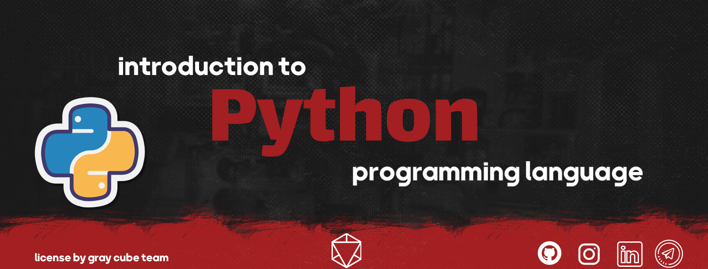

<h3 align="center">"Programming is a different perspective and lifestyle"</h3>
<h3 align="center">"برنامه نویسی یک دیدگاه و سبک زندگی متفاوت است"</h3>

***

<h3 align="center">💢 An introduction to the Python programming language 💢</h3>
<h3 align="center">💢 مقدمه ای بر زبان برنامه نویسی پایتون 💢</h3>

#### 🔷 What exactly is going on here?
> Python is one of the most popular programming languages, which is very attractive and useful for programmers and those interested in this field due to its simplicity and high power. Using Python, one can easily develop applications, websites, games, and many other projects.
Here, we try to give you a complete introduction to the Python language, so that you can easily understand the various concepts of this field and not face any problems in the learning process.
This repository can always be by your side as a cheat sheet for help and guidance in Python and programming projects.

This repository is written in [Persian](https://github.com/graymicro/introduction-to-the-Python-programming-language/tree/master/Persian%20language) and [English](https://github.com/graymicro/introduction-to-the-Python-programming-language/tree/master/English%20language) languages, you can access the contents by choosing either of them.

#### 🔷 دقیقا اینجا چه خبره؟
> پایتون یکی از محبوب‌ترین زبان‌های برنامه‌نویسی است که به دلیل سادگی و قدرت بالایش، برای برنامه‌نویسان و علاقه‌مندان به این حوزه بسیار جذاب و مفید است. با استفاده از پایتون، می‌توان به راحتی، برنامه‌های کاربردی، وب‌سایت‌ها، بازی‌ها، و بسیاری از پروژه‌های دیگر را توسعه داد.
در اینجا، سعی می‌کنیم مقدمه‌ای کامل از زبان پایتون را به شما ارائه دهیم، تا بتوانید به راحتی مفاهیم مختلف این حوزه را درک کنید و در فرایند آموزش با مشکل مواجه نشوید.
این ریپازیتوری، می‌تواند همیشه در کنار شما به عنوان یک برگه تقلب، برای کمک و راهنمایی در انجام پروژه‌های پایتون و برنامه‌نویسی، قرار بگیرد.

این ریپازیتوری به دو زبان [فارسی](https://github.com/graymicro/introduction-to-the-Python-programming-language/tree/master/Persian%20language) و [انگلیسی](https://github.com/graymicro/introduction-to-the-Python-programming-language/tree/master/English%20language) نوشته شده است که شما میتوانید با انتخاب هر کدام از آن ها به محتویات دسترسی داشته باشید 

***

<h3 align="center">♨️ List of chapters provided ♨️</h3>
<h3 align="center">♨️ فهرست فصل های ارائه شده ♨️</h3>
 

- Chapter One [(English language)](https://github.com/graymicro/introduction-to-the-Python-programming-language/tree/master/English%20language/Chapter%20One)  [(Persian language)](https://github.com/graymicro/introduction-to-the-Python-programming-language/tree/master/Persian%20language/Chapter%20One)

  -  🌀 What is programming?
  -  🌀 High, low and intermediate programming language
  -  🌀 General purpose and special purpose languages
  -  🌀 Interpreted and compiler languages
  -  🌀 Static, dynamic, strong and weak typing languages
  -  🌀 Programming paradigms
  -  🌀 The story of Python (History)
  -  🌀 Applications of Python
  -  🌀 What is the algorithm? 
  -  🌀 What is a flowchart?

- Chapter Two [(English language)](https://github.com/graymicro/introduction-to-the-Python-programming-language/tree/master/English%20language/Chapter%20Two)  [(Persian language)](https://github.com/graymicro/introduction-to-the-Python-programming-language/tree/master/Persian%20language/Chapter%20Two)

  -  🌀 Concept of IDE & text editor
  -  🌀 Install python 

- Chapter Three [(English language)](https://github.com/graymicro/introduction-to-the-Python-programming-language/tree/master/English%20language/Chapter%20Three)  [(Persian language)](https://github.com/graymicro/introduction-to-the-Python-programming-language/tree/master/Persian%20language/Chapter%20Three)

  -  🌀 Concept of Variable 
  -  🌀 Python Data Types
  
     - string 
     - integers 
     - bool 
     - float
     - Data Structures(List, Tuple, Dictionaries, set)
     
   - 🌀 Convert data types to each other
  
- Chapter Four [(English language)](https://github.com/graymicro/introduction-to-the-Python-programming-language/tree/master/English%20language/Chapter%20Four/Operators)  [(Persian language)](https://github.com/graymicro/introduction-to-the-Python-programming-language/tree/master/Persian%20language/Chapter%20Four/Operators)

  -  🌀 Arithmetic operators 
  -  🌀 comparison operators
  -  🌀 Assignment operators
  -  🌀 logical operators 
  -  🌀 membership operators
  -  🌀 Identity operators 

- Chapter Five [(English language)](https://github.com/graymicro/introduction-to-the-Python-programming-language/tree/master/English%20language/Chapter%20Five)  [(Persian language)](https://github.com/graymicro/introduction-to-the-Python-programming-language/tree/master/Persian%20language/Chapter%20Five)

  - 🌀 Conditional commands (if, else, elif)
  - 🌀 Loops in Python (for, while)
  - 🌀 Functions 

- Chapter Six [(English language)](https://github.com/graymicro/introduction-to-the-Python-programming-language/tree/master/English%20language/Chapter%20Six)  [(Persian language)](https://github.com/graymicro/introduction-to-the-Python-programming-language/tree/master/Persian%20language/Chapter%20Six)

  - 🌀 Libraries in Python (The concept of script, module, package, library and framework)

- Chapter Seven [(English language)](https://github.com/graymicro/introduction-to-the-Python-programming-language/tree/master/English%20language/Chapter%20One)  [(Persian language)](https://github.com/graymicro/introduction-to-the-Python-programming-language/tree/master/Persian%20language/Chapter%20One)

    - 🌀 What Is Object-Oriented Programming in Python?
    - 🌀 Class in Python

***

<h3 align="center">💣 Support this repository 💣</h3>
 

- By giving this repository a star(⭐️), you made it more visible
- Be sure to send this repository to your friends who are interested in this area
- Follow the gray cube team on other platforms

<h3 align="center">💣 حمایت از این ریپازیتوری 💣</h3>
 

- با دادن یک ستاره(⭐️) به این ریپازیتوری باعث بیشتر دیده تر شدن شدید
- حتما برای دوستانتون که علاقه به این حوضه دارند این ریپازیتوری رو ارسال کنید 
- تیم مکعب خاکستری رو در بقیه [پلتفرم ها](https://graycubeteam.github.io/) دنبال کنید 

***
### 🖊 the writer : Alireza Allahyarian - [Website](http://microhex.info/) - [linkedin](https://www.linkedin.com/in/alireza-allahyarian-658658258/)- [GitHub](https://github.com/graymicro) - [Tlegeram](https://t.me/graycubeteam) 

#### **[♦️license by gray cube team♦️](graycubeteam.github.io)**

